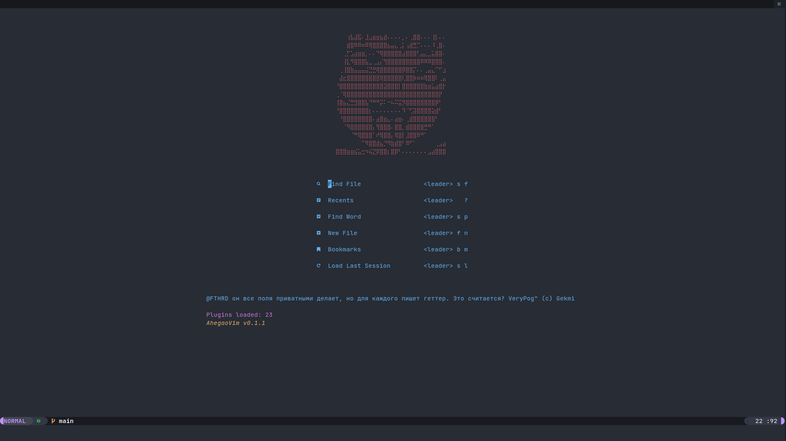
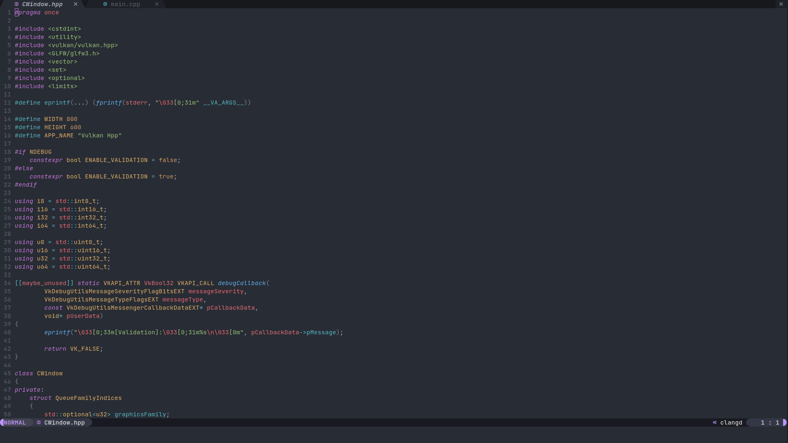

# My nvim config in lua

## Plugins

- [Telescope](https://github.com/nvim-telescope/telescope.nvim)
- [Treesitter](https://github.com/nvim-treesitter/nvim-treesitter)
- [Lspconfig](https://github.com/neovim/nvim-lspconfig)
- [Lspkind](https://github.com/onsails/lspkind-nvim)
- [Nvim-dap](https://github.com/mfussenegger/nvim-dap)
- [Nvim-dap-ui](https://github.com/rcarriga/nvim-dap-ui)
- [Gitsigns](https://github.com/lewis6991/gitsigns.nvim)
- [Dashboard](https://github.com/glepnir/dashboard-nvim)
- [Bufferline](https://github.com/akinsho/bufferline.nvim)
- [Galaxyline](https://github.com/glepnir/galaxyline.nvim)

## Screenshots

